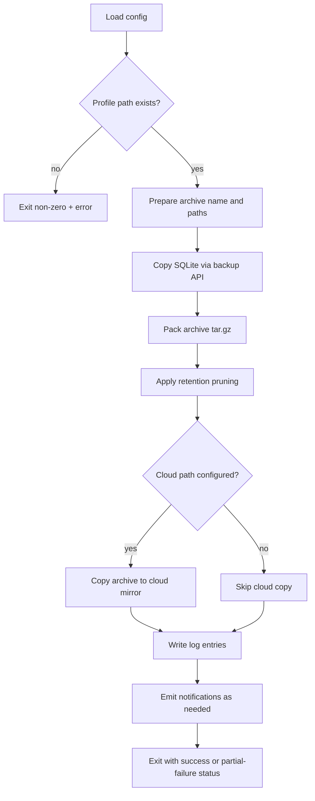
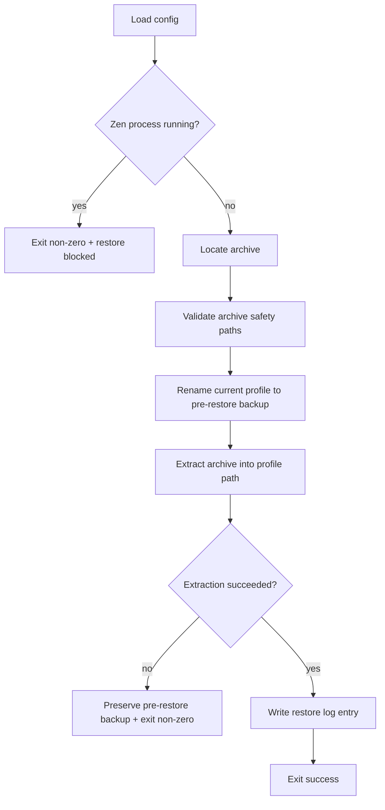
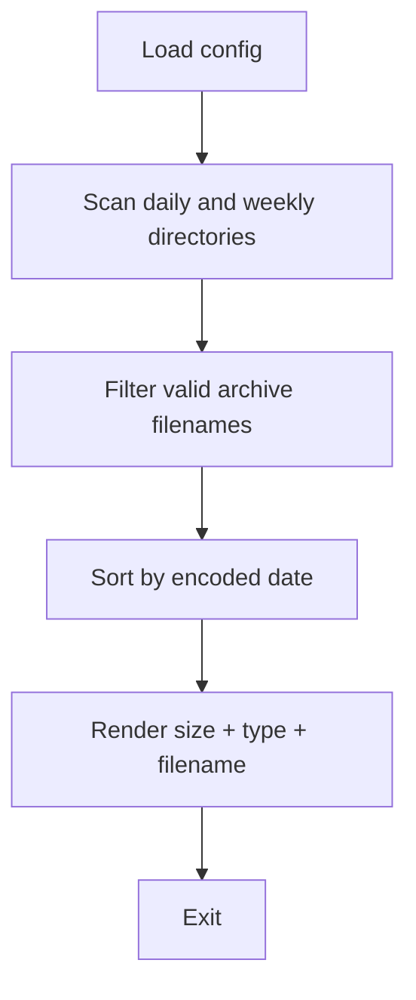
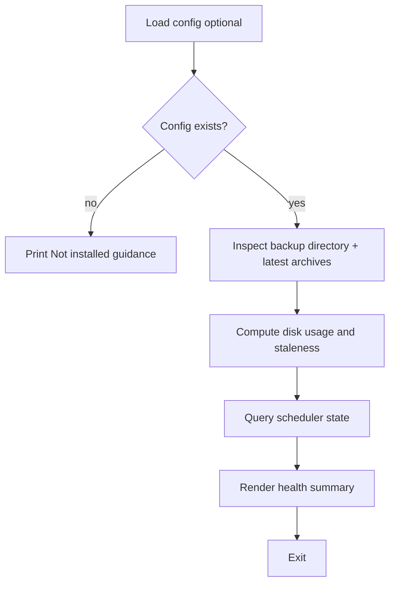
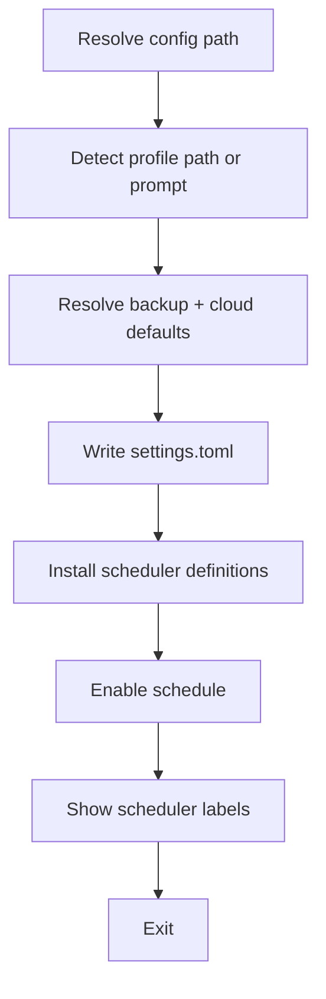
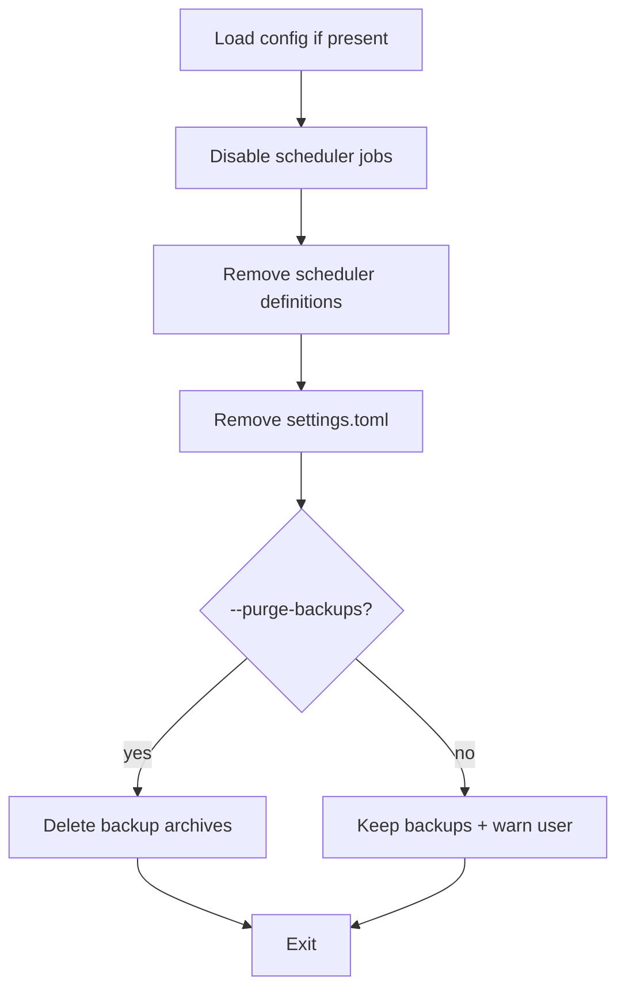
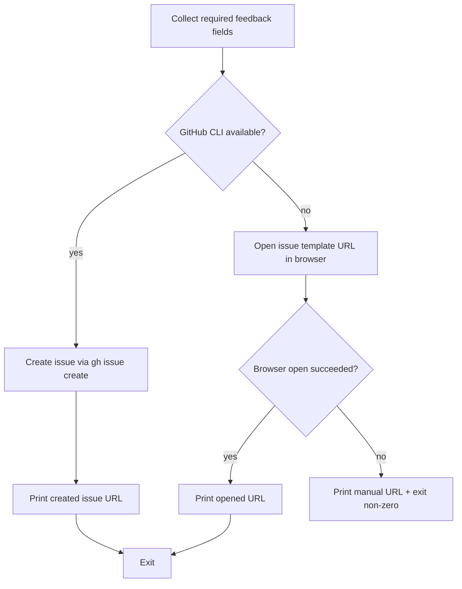
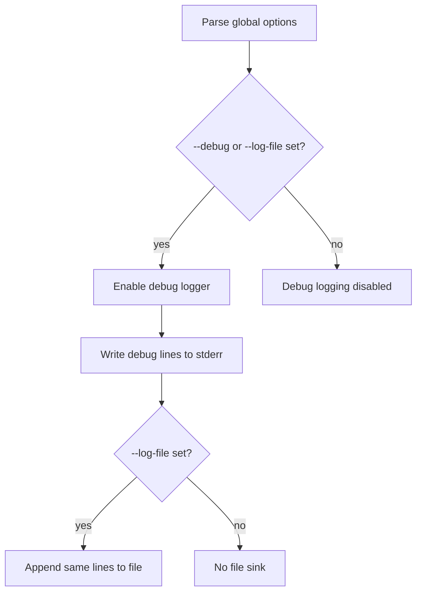
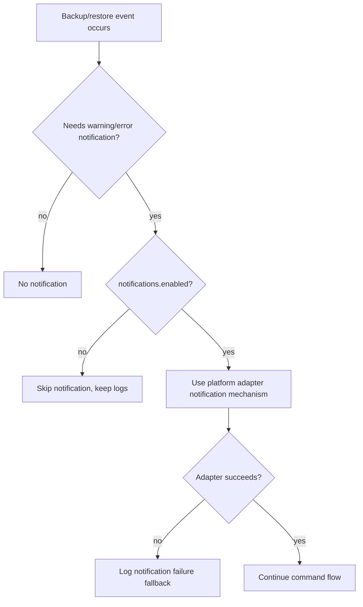
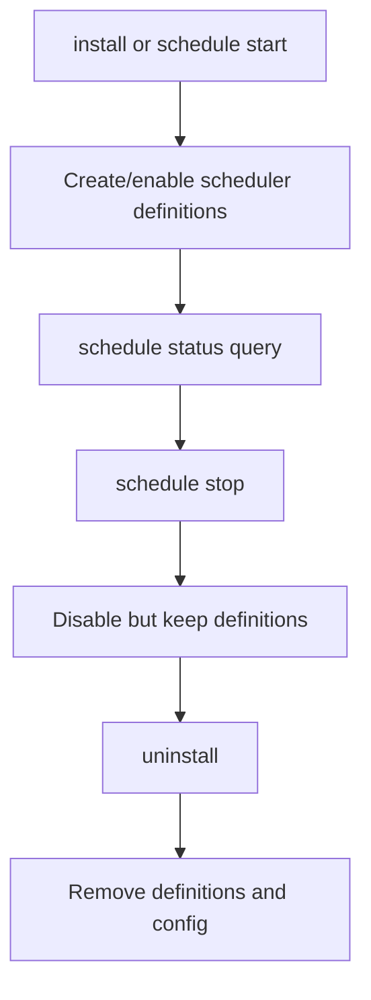

# Command Execution Reference

This reference explains the high-level execution sequence for each `zen-backup` command and the
platform mechanisms used under the hood.

## Cross-Platform Command Flows

### `backup daily|weekly`



### `restore <archive>`



### `list`



### `status`



### `install`



### `uninstall [--purge-backups]`



### `schedule start|stop|status` (`resume` alias of `start`, `pause` alias of `stop`)

```mermaid
flowchart TD
  A[Parse action] --> B{start|stop|status?}
  B -- start --> C[Enable scheduler jobs]
  B -- stop --> D[Disable scheduler jobs]
  B -- status --> E[Query scheduler jobs]
  C --> F[Render per-job state]
  D --> F
  E --> F
  F --> G[Exit]
```

### `feedback bug|request`



### Global Debug Flags (`--debug`, `--log-file [path]`)



## Cross-Platform Lifecycle Generalisms

### Notifications



### Scheduling and Unscheduling



## Platform Mechanism Disclosure

| Concern                        | macOS                                                              | Linux                                                   | Windows                                      |
| ------------------------------ | ------------------------------------------------------------------ | ------------------------------------------------------- | -------------------------------------------- |
| Scheduler install/query/remove | `launchd` plist + `launchctl`                                      | `systemd --user` timers                                 | Task Scheduler (`schtasks` + metadata)       |
| Scheduler pause/resume         | `launchctl unload/load` semantics via adapter                      | `systemctl --user disable/enable` semantics via adapter | Task enable/disable via scheduler adapter    |
| Notification path              | `terminal-notifier` preferred when available, fallback `osascript` | `notify-send` with log fallback                         | PowerShell toast path with fallback logging  |
| Config default location        | `~/.config/zen-profile-backup/settings.toml`                       | `~/.config/zen-profile-backup/settings.toml`            | `%APPDATA%\zen-profile-backup\settings.toml` |
| Feedback fallback              | Open issue template URL in default browser                         | Open issue template URL in default browser              | Open issue template URL in default browser   |

## Traceability

This document is a behavior disclosure view and must remain aligned with product requirements and
acceptance specs:

- Product intent: `docs/product/user-stories.md`
- Acceptance criteria: `docs/features/**/*.feature`
- Command help and user docs: `README.md`
